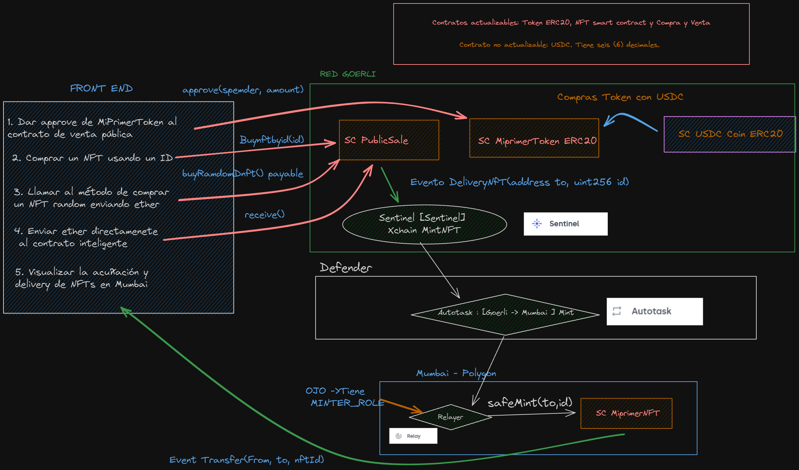
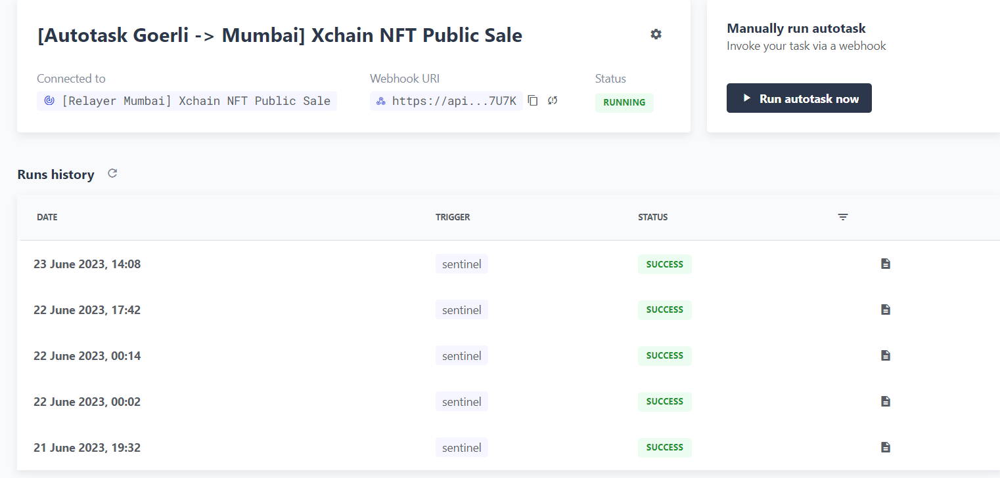
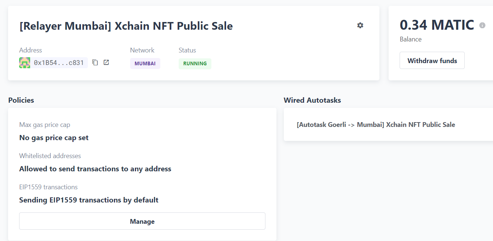
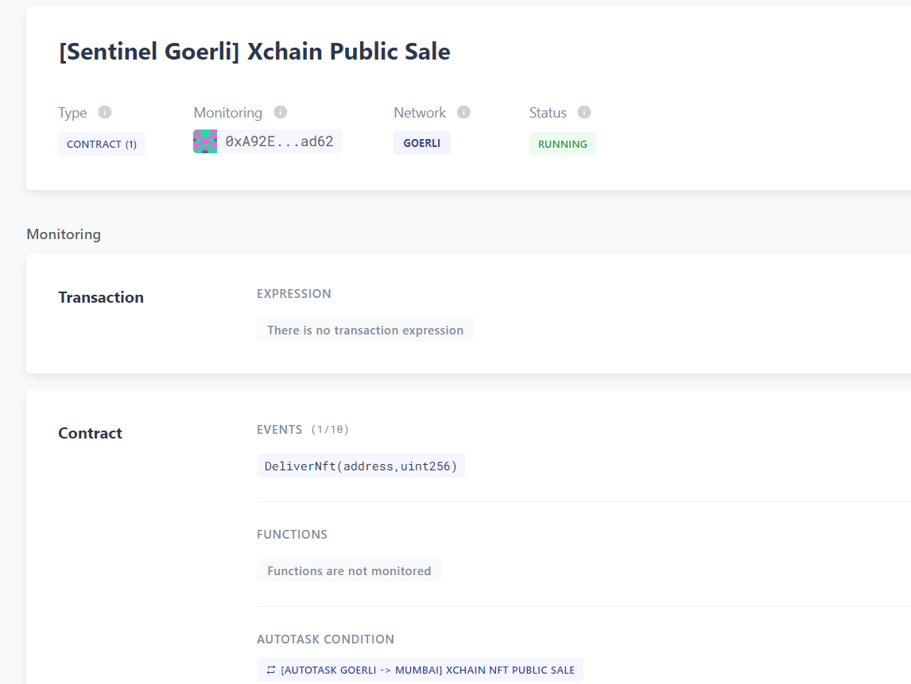

# Practica Final BOOTCAMP SOLIDITY BlockchainBites

## Guía de instalación

Primero clonar el repositorio y acceder a la carpeta

Luego rellenamos el archivo .env de acuerdo al archivo .env-example

Instalacion de dependencias
    
    npm install
    
Para desplegar los contratos usar los scripts(en goerli y mumbai):

    npx hardhat --network mumbai run scripts/deploy.js
    npx hardhat --network goerli run scripts/deployGoerli.js

    
Si se desea cambiar las direcciones de los contratos en el path 

    \src\tokens.json

Para iniciar el frontend usar el comando

    npm run start

Para ejecutar los tests usar el comando

    npx hardhat test .\test\test.js 
    
Y esto seria todo.

## Anexos
### Descripcion de la Arquitectura del Proyecto

### Defender

- Autotask

- Relayer

- Sentinel

